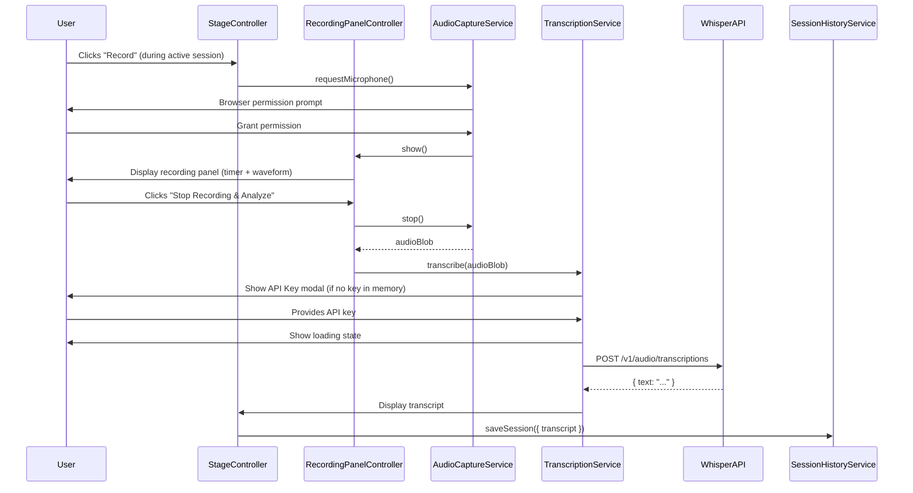

# Design Document

## AI Coaching — Audio Recording & Whisper Transcription

---

## Overview

This feature adds AI coaching capabilities to PitchCraft & Eloquence Studio in two integrated phases:

1. **Audio Recording** — Browser-based microphone capture during active practice sessions using the Web Audio / MediaRecorder API. A Recording Panel modal overlay within the Stage view shows live recording status (timer, waveform animation, stop button).

2. **Whisper Transcription** — After recording stops, the audio Blob is sent to OpenAI's Whisper API (`whisper-1` model) for speech-to-text transcription. The transcript is displayed and persisted in the session history record.

The implementation follows the existing architecture: all code goes inline in `index.html` as plain JavaScript service objects (no classes, no build step). Two new services (`AudioCaptureService`, `TranscriptionService`) and one new UI controller (`RecordingPanelController`) integrate with the existing `StageController`, `SessionHistoryService`, and `AccessibilityService`.

---

## Architecture

### Integration with Existing Structure

```
index.html
└── <body>
    └── #studio
        └── #stage
            ├── [existing session controls]
            ├── #btn-record          ← NEW: Record button (visible during active session)
            ├── #recording-panel     ← NEW: Modal overlay within Stage
            ├── #api-key-modal       ← NEW: API key input modal
            └── #transcription-loading ← NEW: Full-screen loading overlay
    └── <script>
        ├── AudioCaptureService     ← NEW: Microphone + MediaRecorder management
        ├── TranscriptionService    ← NEW: Whisper API calls + API key handling
        ├── RecordingPanelController ← NEW: Recording UI, timer, waveform
        └── StageController          ← MODIFIED: Record button visibility, auto-stop on session end
```

### Data Flow



### Design Decisions

| Decision | Rationale |
|----------|-----------|
| Plain objects (no classes) | Matches existing codebase pattern; all services are object literals |
| API key in memory only | Security requirement; no localStorage persistence of secrets |
| Recording Panel as modal overlay | Follows curveball overlay pattern; keeps focus trapped and accessible |
| Separate recording timer (setInterval) | Independent from session timer; avoids coupling lifecycles |
| CSS waveform animation (5 bars) | Lightweight, no canvas/WebGL; respects `prefers-reduced-motion` |
| audio/webm MIME type | Native browser encoding for MediaRecorder; Whisper accepts webm |
| Auto-stop on session end | Prevents orphaned recordings; packages audio for transcription |

---

## Components and Interfaces

### AudioCaptureService

Manages microphone access, MediaRecorder lifecycle, and audio chunk collection.

```javascript
const AudioCaptureService = {
  _stream: null,
  _recorder: null,
  _chunks: [],
  _isRecording: false,

  /**
   * Request microphone access. Returns a promise resolving to true/false.
   * Announces status to screen readers via AccessibilityService.
   */
  async requestMicrophone() → Promise<boolean>,

  /**
   * Start recording. Requires prior successful requestMicrophone().
   * Initializes MediaRecorder and begins collecting chunks.
   */
  start() → void,

  /**
   * Stop recording. Packages chunks into a single Blob (audio/webm).
   * Releases media stream tracks. Returns the audio Blob.
   * Returns null if no chunks were collected.
   */
  async stop() → Promise<Blob|null>,

  /**
   * Returns true if currently recording.
   */
  isRecording() → boolean,

  /**
   * Check if the browser supports getUserMedia.
   */
  isSupported() → boolean,

  /**
   * Release microphone resources without packaging audio.
   */
  releaseStream() → void
};
```

### TranscriptionService

Handles API key management and Whisper API communication.

```javascript
const TranscriptionService = {
  _apiKey: null,   // In-memory only, never persisted

  /**
   * Set the API key for the current browser session.
   */
  setApiKey(key: string) → void,

  /**
   * Returns true if an API key is currently held in memory.
   */
  hasApiKey() → boolean,

  /**
   * Clear the stored API key from memory.
   */
  clearApiKey() → void,

  /**
   * Send audio to Whisper API for transcription.
   * Returns { success: true, text } or { success: false, error, statusCode? }.
   */
  async transcribe(audioBlob: Blob) → Promise<TranscriptionResult>,
};
```

### RecordingPanelController

UI controller for the recording modal overlay, timer, and waveform.

```javascript
const RecordingPanelController = {
  _intervalId: null,
  _startTime: null,
  _elapsed: 0,

  /**
   * Show the recording panel overlay. Traps focus.
   * Starts the recording timer (separate from session timer).
   * Announces "Recording started" to screen readers.
   */
  show() → void,

  /**
   * Hide the recording panel. Releases focus trap.
   * Stops the recording timer.
   */
  hide() → void,

  /**
   * Update the timer display (called every 1000ms).
   */
  tick() → void,

  /**
   * Handle "Stop Recording & Analyze" button click.
   * Stops AudioCaptureService, initiates transcription flow.
   */
  handleStop() → void,

  /**
   * Show/hide the API key modal. Returns a promise that resolves
   * when the user submits a key, or rejects on cancel.
   */
  showApiKeyModal() → Promise<string>,

  /**
   * Show the theatrical loading overlay during transcription.
   */
  showLoading() → void,

  /**
   * Hide the loading overlay.
   */
  hideLoading() → void,

  /**
   * Display the transcript result to the user.
   */
  showTranscript(text: string) → void,

  /**
   * Display an error message to the user.
   */
  showError(message: string) → void
};
```

### StageController Modifications

```javascript
// Added to StageController:

/**
 * Show or hide the Record button based on session status.
 * Called from startSession(), endSession(), pauseSession(), resumeSession().
 */
updateRecordButton() → void,

/**
 * Modified endSession(): If AudioCaptureService.isRecording(),
 * auto-stop and package audio before saving session.
 */
endSession() → void  // (modified)
```

### SessionHistoryService Modifications

The existing `saveSession()` method already has `transcript` and `aiFeedback` fields in the record schema (currently always `null`). The modification passes the transcript string when available:

```javascript
// Modified call in StageController.endSession():
SessionHistoryService.saveSession({
  mode: mode.id,
  elapsed: AppState.session.elapsed,
  phasesCompleted: AppState.session.phasesCompleted,
  curveballsShown: AppState.session.curveballsShown,
  transcript: AppState.session.transcript || null  // NEW
});
```

---

## Data Models

### AppState Extensions

```javascript
// Added to AppState.session:
{
  ...existingFields,
  recording: false,       // Whether recording is currently active
  transcript: null        // String transcript text or null
}
```

### TranscriptionResult

```javascript
// Success
{ success: true, text: "transcribed text here" }

// Failure
{ success: false, error: "Human-readable error message", statusCode: 401 }
```

### Session Record (existing schema, now populated)

```javascript
{
  id: "1234567890-abc",
  timestamp: "2024-01-15T10:30:00.000Z",
  sessionMode: "elevator-pitch",
  duration: 120,
  phasesCompleted: ["Hook", "Problem", "Solution"],
  curveballsFaced: 2,
  transcript: "Good morning everyone, today I want to talk about...",  // NEW: populated
  aiFeedback: null  // Reserved for future AI feedback feature
}
```

### CSS Waveform Animation

```css
.recording-waveform {
  display: flex;
  align-items: center;
  justify-content: center;
  gap: 3px;
  height: 40px;
}

.recording-waveform__bar {
  width: 4px;
  background: var(--color-studio-primary);
  border-radius: 2px;
  animation: waveform-pulse 1.2s ease-in-out infinite;
}

.recording-waveform__bar:nth-child(1) { animation-delay: 0s; }
.recording-waveform__bar:nth-child(2) { animation-delay: 0.15s; }
.recording-waveform__bar:nth-child(3) { animation-delay: 0.3s; }
.recording-waveform__bar:nth-child(4) { animation-delay: 0.45s; }
.recording-waveform__bar:nth-child(5) { animation-delay: 0.6s; }

@keyframes waveform-pulse {
  0%, 100% { height: 8px; }
  50% { height: 32px; }
}

/* Reduced motion: static bars */
@media (prefers-reduced-motion: reduce) {
  .recording-waveform__bar {
    animation: none;
    height: 16px;
  }
}
```

### Recording Panel HTML Structure

```html
<div id="recording-panel" class="recording-panel" role="dialog" aria-modal="true"
     aria-label="Recording in progress" hidden>
  <div class="recording-panel__content">
    <div class="recording-panel__status">
      <span class="recording-panel__indicator" aria-hidden="true"></span>
      <span class="recording-panel__timer" id="recording-timer">00:00</span>
    </div>
    <div class="recording-waveform" aria-hidden="true">
      <div class="recording-waveform__bar"></div>
      <div class="recording-waveform__bar"></div>
      <div class="recording-waveform__bar"></div>
      <div class="recording-waveform__bar"></div>
      <div class="recording-waveform__bar"></div>
    </div>
    <button id="btn-stop-recording" class="btn btn--primary"
            aria-label="Stop recording and analyze speech">
      Stop Recording &amp; Analyze
    </button>
  </div>
</div>
```

### API Key Modal HTML Structure

```html
<div id="api-key-modal" class="modal-overlay" role="dialog" aria-modal="true"
     aria-labelledby="api-key-title" hidden>
  <div class="modal-overlay__content">
    <h2 id="api-key-title">Enter OpenAI API Key</h2>
    <p>Your key is used for this session only and is never stored.</p>
    <form id="api-key-form">
      <label for="api-key-input" class="sr-only">OpenAI API Key</label>
      <input id="api-key-input" type="password" placeholder="sk-..."
             autocomplete="off" required />
      <div class="modal-overlay__actions">
        <button type="submit" class="btn btn--primary">Submit</button>
        <button type="button" id="btn-cancel-api-key" class="btn btn--secondary">Cancel</button>
      </div>
    </form>
  </div>
</div>
```

### Loading State HTML Structure

```html
<div id="transcription-loading" class="loading-overlay" role="alert" aria-live="assertive" hidden>
  <div class="loading-overlay__content">
    <p class="loading-overlay__text">Transcribing your audio waveform...</p>
    <div class="loading-overlay__animation" aria-hidden="true">
      <span class="loading-dot"></span>
      <span class="loading-dot"></span>
      <span class="loading-dot"></span>
    </div>
  </div>
</div>
```

---

## Correctness Properties

*A property is a characteristic or behavior that should hold true across all valid executions of a system — essentially, a formal statement about what the system should do. Properties serve as the bridge between human-readable specifications and machine-verifiable correctness guarantees.*

### Property 1: Audio chunk packaging produces valid Blob

*For any* sequence of non-empty audio data chunks collected by AudioCaptureService, stopping the recording SHALL produce a single Blob of MIME type `audio/webm` whose size equals the combined size of all input chunks.

**Validates: Requirements 3.1, 3.2**

### Property 2: Empty recording detection

*For any* recording session where zero audio data chunks are collected, stopping the recording SHALL return null (not a Blob) and trigger an error state.

**Validates: Requirements 3.3**

### Property 3: Recording timer format consistency

*For any* elapsed time value in seconds (0 to 5999), the recording timer display SHALL render as a string matching the format `MM:SS` where MM is zero-padded minutes and SS is zero-padded seconds.

**Validates: Requirements 2.1**

### Property 4: API key never persisted

*For any* sequence of operations on TranscriptionService (setApiKey, transcribe, clearApiKey), the API key SHALL never appear in localStorage, sessionStorage, cookies, or any persistent storage mechanism.

**Validates: Requirements 4.3**

### Property 5: Whisper API request structure

*For any* valid audio Blob and API key, the FormData request sent to the Whisper API SHALL contain exactly: a "file" field with the Blob, a "model" field set to "whisper-1", and an Authorization header with value "Bearer {apiKey}".

**Validates: Requirements 5.1, 5.2**

### Property 6: Transcript round-trip persistence

*For any* successful transcription result text, when a session ends with that transcript, the SessionHistoryService record SHALL contain the identical transcript string when loaded back from localStorage.

**Validates: Requirements 7.1, 7.2**

### Property 7: Record button visibility invariant

*For any* application state, the Record button SHALL be visible if and only if `AppState.session.status === 'running'` or `AppState.session.status === 'paused'`.

**Validates: Requirements 8.1, 8.2**

### Property 8: Auto-stop on session end preserves audio

*For any* active recording when endSession() is called, the AudioCaptureService SHALL be stopped and the resulting audio Blob SHALL be non-null (assuming chunks were collected), identical to what would be produced by a manual stop.

**Validates: Requirements 8.3**

### Property 9: Reduced motion disables waveform animation

*For any* recording panel display when `prefers-reduced-motion: reduce` is active, all waveform bar elements SHALL have `animation: none` (via CSS) and display at a static height.

**Validates: Requirements 2.3**

### Property 10: Error classification correctness

*For any* HTTP error response from the Whisper API, the TranscriptionService SHALL return an error object where: status 401 produces an "invalid API key" message, other 4xx/5xx produce a message including the status code, and network failures produce a "network error" message.

**Validates: Requirements 5.4, 5.5, 5.6**

---

## Error Handling

### Microphone Access Errors

| Condition | Behavior |
|-----------|----------|
| User denies permission | Display inline error: "Microphone access is required for recording. Please allow microphone access and try again." |
| Browser unsupported | Display inline error: "Your browser does not support audio recording. Please use a modern browser." |
| Device not found | Display inline error: "No microphone detected. Please connect a microphone." |

All errors are announced to screen readers via `AccessibilityService.announce()` with `assertive` politeness.

### Recording Errors

| Condition | Behavior |
|-----------|----------|
| No audio chunks collected | Display error: "No audio was captured. Please check your microphone and try again." |
| MediaRecorder error event | Stop recording gracefully, display generic recording error |

### Transcription Errors

| Condition | Behavior |
|-----------|----------|
| 401 Unauthorized | "Invalid API key. Please re-enter your key." + re-show API key modal |
| 4xx/5xx (other) | "Transcription failed (HTTP {code}). Please try again." |
| Network failure | "Network error. Please check your connection and try again." |
| User cancels API key input | Return to session state without transcription |

### Resource Cleanup

- MediaStream tracks are always released after recording stops (success or error)
- Recording timer interval is always cleared when panel hides
- Loading overlay is always dismissed on transcription completion or error

---

## Testing Strategy

### Property-Based Testing (fast-check)

The project uses `fast-check` (already installed) with Vitest for property-based tests. Each property from the Correctness Properties section maps to a dedicated `.property.test.js` file.

**Configuration:**
- Minimum 100 iterations per property test
- Tag format in comments: `Feature: ai-coaching, Property N: {description}`

**Target test file:** `tests/ai-coaching.property.test.js`

**Properties to implement:**
1. Audio chunk packaging (Property 1)
2. Empty recording detection (Property 2)
3. Timer format consistency (Property 3)
4. API key non-persistence (Property 4)
5. Whisper request structure (Property 5)
6. Transcript round-trip persistence (Property 6)
7. Record button visibility invariant (Property 7)
8. Auto-stop audio preservation (Property 8)
9. Reduced motion waveform (Property 9)
10. Error classification (Property 10)

### Unit Tests

**Target test file:** `tests/ai-coaching.test.js`

Specific examples and integration points:
- AudioCaptureService: mock `navigator.mediaDevices.getUserMedia`, verify lifecycle
- TranscriptionService: mock `fetch`, verify FormData construction and error handling
- RecordingPanelController: verify timer display updates, panel show/hide, focus management
- StageController integration: verify Record button appears/disappears with session state
- Accessibility: verify ARIA announcements on recording start/stop/error
- API key modal: verify password masking, submit/cancel flows

### Testing Utilities

Tests will mock:
- `navigator.mediaDevices.getUserMedia` — return mock MediaStream
- `MediaRecorder` — mock constructor with start/stop/ondataavailable
- `fetch` — mock Whisper API responses (success, 401, 500, network error)
- `localStorage` — use jsdom's built-in implementation
- `window.matchMedia` — mock for reduced-motion testing
