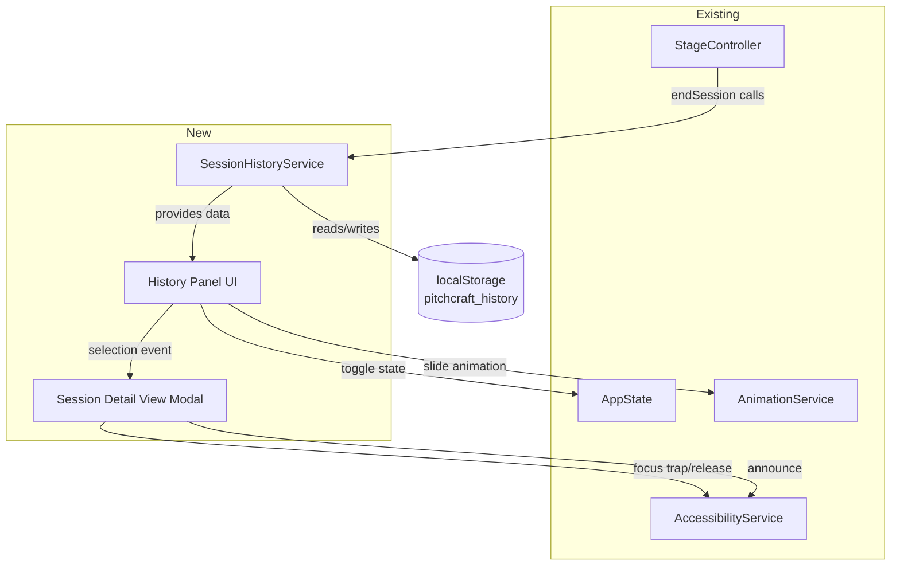

# Design Document: Session History

## Overview

The Session History feature adds persistent session tracking and review capabilities to PitchCraft & Eloquence Studio. When a practice session completes, the application automatically captures session metadata (mode, duration, phases, curveballs) and stores it in browser localStorage under a dedicated key. A collapsible side panel within the Stage section provides chronological browsing, and a torn-page modal allows detailed review of any past session.

All code lives inline in `index.html`, following the existing single-file architecture. The feature introduces one new service object (`SessionHistoryService`) and extends the existing `StageController.endSession()` flow with a save hook.

## Architecture



**Data Flow:**
1. `StageController.endSession()` packages session data and calls `SessionHistoryService.saveSession(record)`.
2. `SessionHistoryService` validates the record, appends it to the localStorage array (capped at 50), and serializes.
3. On app init, `SessionHistoryService.loadHistory()` hydrates the in-memory history array sorted newest-first.
4. The History Panel renders from this in-memory array. Clicking an item opens the Session Detail View modal.

## Components and Interfaces

### SessionHistoryService

A plain object following the same pattern as `StorageService`.

```javascript
const SessionHistoryService = {
  _KEY: 'pitchcraft_history',
  _MAX_RECORDS: 50,
  _history: [],

  /** Load history from localStorage on init. Returns sorted array (newest first). */
  loadHistory() → SessionRecord[],

  /** Save a new session record. Validates, generates id, appends, trims to max, persists. */
  saveSession(data: { mode, elapsed, phasesCompleted, curveballsShown }) → SessionRecord | null,

  /** Get all records (in-memory cache). */
  getAll() → SessionRecord[],

  /** Get a single record by id. */
  getById(id: string) → SessionRecord | null,

  /** Generate a unique id: timestamp + random suffix. */
  _generateId() → string,

  /** Validate a record has all required fields. */
  _validate(record: SessionRecord) → boolean,

  /** Persist current _history to localStorage. */
  _persist() → void
};
```

### History Panel (UI within Stage section)

- Toggle button in the stage header area (follows `nav__tab` styling).
- Collapsible left-side panel that slides in/out.
- Renders a list of session items showing: mode label, formatted date/time, duration.
- Empty state message when no history exists.
- On mobile (<768px), overlays full width.

### Session Detail View (Modal)

- Fixed overlay following the curveball torn-page `clip-path` aesthetic.
- Displays: mode label, date/time, duration, phases completed, curveballs faced.
- Placeholder sections for Transcript and AI Feedback.
- Close button + Escape key dismissal.
- Focus trapping via `AccessibilityService.trapFocus()`.

### Integration with StageController

The existing `endSession()` method will be extended to call `SessionHistoryService.saveSession()` after setting status to `'completed'` and computing phases. This is a minimal, non-breaking change — a single function call added at the end of the method.

## Data Models

### SessionRecord

```typescript
interface SessionRecord {
  id: string;               // Unique id: `${Date.now()}-${randomChars}`
  timestamp: string;        // ISO 8601 format, e.g., "2024-12-15T14:30:00.000Z"
  sessionMode: string;      // Mode id from SESSION_MODES (e.g., "elevator-60")
  duration: number;         // Elapsed seconds (integer)
  phasesCompleted: string[];// Array of phase name strings
  curveballsFaced: number;  // Count of curveballs shown
  transcript: null;         // Placeholder for future AI integration
  aiFeedback: null;         // Placeholder for future AI integration
}
```

### localStorage Schema

Key: `"pitchcraft_history"`
Value: JSON-serialized array of `SessionRecord` objects, ordered newest-first, max length 50.

```json
[
  {
    "id": "1702654200000-x7k2m",
    "timestamp": "2024-12-15T14:30:00.000Z",
    "sessionMode": "elevator-60",
    "duration": 58,
    "phasesCompleted": ["Hook", "Problem", "Solution", "CTA"],
    "curveballsFaced": 2,
    "transcript": null,
    "aiFeedback": null
  }
]
```

### AppState Extension

A `historyPanelOpen` boolean is added to `AppState`:

```javascript
const AppState = {
  // ... existing fields ...
  historyPanelOpen: false
};
```

## Correctness Properties

*A property is a characteristic or behavior that should hold true across all valid executions of a system — essentially, a formal statement about what the system should do. Properties serve as the bridge between human-readable specifications and machine-verifiable correctness guarantees.*

### Property 1: Save-then-load round trip

*For any* valid session data (mode, elapsed, phasesCompleted, curveballsShown), saving a session via `SessionHistoryService.saveSession()` and then loading history via `SessionHistoryService.loadHistory()` SHALL produce an array containing a record whose fields match the original input data.

**Validates: Requirements 1.1, 1.2, 2.1**

### Property 2: Record cap enforcement

*For any* sequence of N save operations where N > 50, `SessionHistoryService.getAll()` SHALL return at most 50 records, and those records SHALL be the 50 most recent by timestamp.

**Validates: Requirements 1.4, 6.1**

### Property 3: Descending sort invariant

*For any* loaded history array with 2 or more records, each record's timestamp SHALL be greater than or equal to the next record's timestamp (i.e., the array is sorted in descending chronological order).

**Validates: Requirements 2.4, 3.4**

### Property 4: Invalid record rejection

*For any* session data object missing one or more required fields (sessionMode, duration, phasesCompleted, curveballsFaced), `SessionHistoryService.saveSession()` SHALL return null and the stored history SHALL remain unchanged.

**Validates: Requirements 6.3, 6.4**

### Property 5: Malformed data resilience

*For any* non-array or unparseable string stored at the `pitchcraft_history` localStorage key, `SessionHistoryService.loadHistory()` SHALL return an empty array without throwing an error.

**Validates: Requirements 2.2, 2.3**

### Property 6: Unique ID generation

*For any* two session records saved (even with identical input data), the generated `id` fields SHALL be distinct.

**Validates: Requirements 6.2**

### Property 7: Existing records preservation

*For any* pre-existing history array of K records (where K < 50) and a new valid save operation, the resulting array SHALL contain all K original records plus the new record (K + 1 total).

**Validates: Requirements 1.4**

## Error Handling

| Scenario | Behavior |
|----------|----------|
| localStorage unavailable (private browsing, disabled) | `saveSession` and `loadHistory` catch exceptions and return gracefully (null / empty array). App continues without interruption. |
| localStorage quota exceeded | `_persist()` catches the error silently. The in-memory state remains valid for the current session but won't survive page reload. |
| Stored JSON is malformed | `loadHistory()` catches parse errors, returns `[]`, and resets the key to a valid empty array on next save. |
| Record fails validation | `saveSession()` returns null. No mutation of stored data. No user-facing error. |
| Missing DOM elements | All UI methods use null-checks (`if (el)`) before manipulation, matching existing patterns throughout the codebase. |

## Testing Strategy

### Unit Tests (example-based)

- Verify `SessionHistoryService` CRUD operations with concrete fixtures.
- Verify empty-state UI rendering in the History Panel.
- Verify Session Detail View displays correct fields for a known record.
- Verify focus trap activation/release in the modal.
- Verify toggle button label changes between "Open session history" / "Close session history".
- Verify reduced-motion suppresses slide animation classes.

### Property-Based Tests

Using the project's existing Vitest + fast-check setup:

- **Feature: session-history, Property 1: Save-then-load round trip** — Generate arbitrary valid session data, save, reload, verify presence.
- **Feature: session-history, Property 2: Record cap enforcement** — Generate sequences of 50+ saves, verify cap.
- **Feature: session-history, Property 3: Descending sort invariant** — Generate multiple saves with varying timestamps, verify sort.
- **Feature: session-history, Property 4: Invalid record rejection** — Generate objects with randomly missing required fields, verify rejection.
- **Feature: session-history, Property 5: Malformed data resilience** — Generate arbitrary non-JSON or non-array strings, store them, verify graceful load.
- **Feature: session-history, Property 6: Unique ID generation** — Generate pairs of identical inputs saved in sequence, verify distinct IDs.
- **Feature: session-history, Property 7: Existing records preservation** — Generate initial arrays of records + a new save, verify all originals preserved.

Each property test runs a minimum of 100 iterations.

### Integration Tests

- End-to-end flow: start session → end session → verify record appears in History Panel.
- Panel toggle open/close with keyboard navigation.
- Session Detail View open from panel → verify content → close with Escape.
- Mobile viewport: panel overlays full width.

### Accessibility Tests

- ARIA roles and labels on panel and modal elements.
- Focus management: trap in modal, release on close, return to prior focus.
- Screen reader announcements on panel open/close.
- Full keyboard navigability (Tab, Shift+Tab, Enter, Escape).
